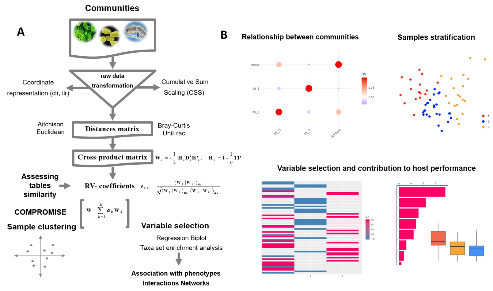
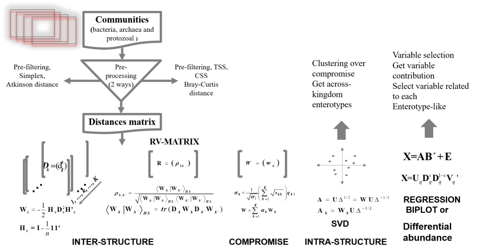

# Version Info
```{r, echo=FALSE, results="hide", warning=FALSE}
suppressPackageStartupMessages({
library('LinkHD')
})
```


## Introduction 

Recent advances in omics technologies have revolutionized biological research providing vast amounts of heterogeneous data. The drop in ‘omics’ technologies costs enables collection of data from multiple sources; facilitating the study of gene expression, proteins, metagenomics and metabolites, and to evaluate their relationship with  health and diseases status. However, the integration of these heterogeneous datasets is not a trivial task. Several statistical methods have been developed to handle these challenges     [@mixkernel,@mixomics,@mofa]. **STATIS-ACT** [@DesPlan, @escoufier1976] is one of the methods capable of analyzing  data arising from several configurations and to compare subspaces. 

STATIS is a **PCA** extension to analyze multiple datasets of variables collected from the same individual or the same variables collected from multiple individuals [@Lavit1994]. The method was designed to integrate several datasets into an optimum space called compromise. However, STATIS has some constraint since can only be used with continuous data.  In addition, the subspace generated by STATIS only can establish relationships between common elements in all datasets, i. e. observations (samples) or variables (genes/transcripts/proteins/metabolites/microbial communities), leading to additional drawbacks. Neither is it possible to establish relationships between observations and variables, nor can it provide a variable selection strategy.

Here, we present **Link-HD**, an R package to integrate multiple heterogeneous datasets based on STATIS. Our approach is a generalization of multidimensional scaling, which uses distance matrices for numerical, categorical or compositional variables instead of the raw data. Furthermore, the methodology was enhanced with Regression Biplot [@Gabriel1971,@gowerH] and differential abundance testing to perform variable selection and to identify OTUs that differ between two or more categories.

##Methods

Our package was designed to integrate multiple communities from a holistic view. It can deal with compositional data, and it includes centered log ratio and cumulative-sum scaling (CSS)  [@CSS1] transformations. Link-HD also incorporates variable selection and visualization tools which allows for a  better undestunding of communities structure, and, their relationship with target traits. 


Link-HD pipeline overview. First, raw data are transformed using cumulative sum scaling (CSS) [@CSS1] or centered log ratio transformation (clr) [@aitchison1982]. Second, distance and cross -product matrices are obtained to assess the similarity between datasets. Third, the compromise uses the first eigenvectors from RV to build the common configuration W matrix. The intra-structure step is the eigen-decomposition of W, where each observation is projected onto the common configuration. In this step, clusters of observations can be obtained. Finally, relationships between clusters and targets can identify selected variables responsible for the attained structure.  (B) Link-HD includes visualization tools to explore relationships between data. In this example from the rumen microbiota it is shown: cross-product matrices relationships (upper left panel), 'ruminotypes' from the consensus structure (upper right panel) and the abundance between variables responsible of the obtained structure (lower panel). 

### STATIS: a general overview

STATIS-ACT [@DesPlan, @escoufier1976] aims is to compare and analyze the relationships between data that share a common collection of observations,  but each may have different variables. The data consists of $k$ matrices $X_{[k]}$ of $n \times j_{[k]}$ , where $n$ is the number of observations and $j_{[k]}$ the number of variables measured in $k-th$ matrix. The idea behind STATIS is to obtain a compromise matrix, which is a linear combination of the matrices from the initial tables.  The analysis of this matrix gives a two/three -dimensional representation (principal axes maps) that can be used to interpret its structure. The methodology is implemented in three main phases [\@ref(fig:Method)]:


* Inter-structure: It measures the similarity between the $k$ configurations of the matrices. This phase is equivalent to defining a distance among the corresponding scalar product matrices.

* Compromise: It generates an optimal weight coefficient for each $k$ matrix, in order to construct a common structure for all configurations.

* Intra-structure: It is a generalized **PCA** analysis of the structure obtained in the previous stage.



STATIS overview. This figure shows the three steps of the STATIS: Inter-structure, Compromise and Intra-structure. In the inter-structure, the similarity dataset structure is analyzed and each $X_{[k]}$ matrix is then projected onto the first and second components of the $Q$ matrix. The compromise uses the first eigenvectors from $Q$ to build the common configuration $W$ matrix. Finally, the intra-structure step is the eigen-decomposition of $W$ and each observation is projected onto the first and second components of the $A$ matrix.


The mathematics behind the methodology can be described as follows.  The first task requires computations of $k$ configurations of symmetrical matrices $W_{[k]}$ for each $X_{[k]}$ matrix of dimension $n \times j_{[k]}$ according to equation (\@ref(eq:inter-structure)):


\begin{equation}
 (\#eq:inter-structure)
W_{[k]}=X_{[k]}M_{[k]}X^\top_{[k]}
\end{equation}

where $W_{[k]}$ is a square matrix of size $n$; $M_{[k]}$ is a diagonal matrix including the  variable weights, which is generally the same matrix for all the $k$ matrices $M=M_{[k]}=\frac{1}{j_{[k]}}I_{j_{[k]}}$ where $I_{j_{[k]}}$ is the identity matrix of size $j_{[k]}$; and $X^\top_{[k]}$ denotes the transpose of $X_{[k]}$ matrix. Then, the similarity between the two configurations $k$ and $k^\prime$ can be established computing the Hilbert-Smith product of equation ($<.>_{HS}$, [@RobertRV]) presented in equation \@ref(eq:hs) or in its normalized version $\rho_{k,k^\prime}$.

\begin{eqnarray}
(\#eq:hs)
\langle W_{[k]} \arrowvert W_{[k^\prime]}\rangle_{HS} =
\left\{
  \begin{array}{cl}
    tr(DW_{[k]}DW_{[k^\prime]}) & if~k \neq k^\prime\\
    ||W_{[k]}||^2 & if~k = k^\prime
  \end{array}
\right.\\
(\#eq:hs-weigthed)
\rho_{k,k^\prime}=\frac{\langle W_{[k]} \arrowvert W_{[k^\prime]} \rangle_{HS}}{\sqrt{\langle W_{[k]} \arrowvert W_{[k]} \rangle_{HS}\langle W_{[k^\prime]} \arrowvert W_{[k^\prime]} \rangle_{HS}}}
\end{eqnarray}

$tr(.)$ is the trace of the argument matrix; $D$ is the square weighted observation matrix of size $n$, which in general is $D=\frac{1}{n}I_n$; and $||.||^2$ is the classic Euclidean norm-2 of the argument matrix. In this context, equation \@ref(eq:hs) can be geometrically interpreted  as the scalar product between two positive semi-definite matrices, which is proportional to the cosine of the angle between them.

The *inter-structure's* objective is to decide whether or not there is a common structure to all representative $W_{[k]}$'s objects. The scalar products $\rho_{k,k^\prime}$ can be organized in a $k \times k$ positive semi-definite matrix $R$ and their spectral decomposition obtains the similarity analysis among the configurations as a generalized correlation coefficient.

However, the formulation from the \@ref(eq:inter-structure) has some restrictions, i.e., it only can be computed when all observations are continuous. This constraint can be averted by replacing the scalar product \@ref(eq:inter-structure) between observations by a generalized distance cross-product matrix. In Link-HD, we implemented euclidean, canberra, pearson, pearsonabs, spearman, spearmanabs, mahalanobis, jaccard, simple matching and  Aitchison distances. Then, each $W_k$ is obtained as follows: 

\begin{eqnarray}
(\#eq:distance)
W_{k}=\frac{1}{2} H_k D^2 H'_k
\\
(\#eq:H)
H=I-\frac{1}{n} 11'
\end{eqnarray}

whre $D^2$ in \@ref(eq:distance) is a distance matrix computed from the raw data ($X$) and $W_k$ is the cross-product transformation of $D$. 

$W$, the matrix that summarize all of $W_{k}$ can be obtained by a weighted mean of the $W_{[k]}$ configurations [@lavit1988]:


\begin{eqnarray}
(\#eq:compromise)
W=\sum_{k=1}^{K}\alpha_{[k]}W_{[k]}\\
(\#eq:compromise-alpha)
\alpha=(1^{T}q_{1})^{-1} \times q_{1}
\end{eqnarray}

where, $\alpha$, is the vector with optimal weights, obtained by re-scaling these values such that their sum is equal to one; $q_1$, is the first eigenvector of the $R$ matrix and $\alpha_{[k]}$, is the weight coefficient for the $k$ configuration.

The *compromise* is a cross-product matrix and it can be eigen-decomposed. Thus, it is possible to obtain a graphical representation from their Principal Components Analysis (*PCA*) where the scores are the best common representation for the set of $K$ matrices. Moreover, scores can be used to perform a cluster analysis in the common subspace. 

## Selecting variables

### Regression Biplot approach 

Classical STATIS is neither designed to establish relationships between observations and variables, nor to perform variable selection. However, the general regression biplot formulation from  @gowerH averts these limitations.

\begin{equation}
X\approx AB^\top+\varepsilon
(\#eq:eq10)
\end{equation}

The equation \@ref(eq:eq10) can be understood as a multivariate regression of $X$ on the coordinates of rows $A$, when they are fixed, or a multivariate regression of $X^T$ on the coordinates of the variables $B$, if they are fixed. Then, we could easily define a regression biplot through a classical linear model, i. e., $E(X)=AB^\top$  if the response has a normal distribution, or using a generalized linear model $E(X)=g(\mu)=AB^\top$ when the response variable has an exponential family distribution and the link function used is $g(.)$ [@greenacre].  Here, we used the ideas from \@ref(eq:eq10)  to project all variables into the common subspace obtained by the interstructure step. Variables are selected using the accuracy of the regression biplot, which is measured using the proportion of explained variance by each regression (adjusted r squared from the model).

### Differential abundance approach 

Link-HD also implements a differential abundance analysis which is computed using a rank-based nonparametric Kruskal-Wallis test  [@kruskal]. Variables are selected after applying a procedure that controls the false discovery rate (FDR) [@benjamini1995]. 

## Usage

## Software Installation

You need devtools to install LinkHD


```{r,results=' hide',eval=FALSE}
#if you don't have devtools, please install it:
install.packages("devtools")
#if devtools is already installed, ommit previous step
library(devtools)
devtools::install_github(repo ="lauzingaretti/LinkHD" ,dependencies = TRUE)
library(LinkHD)
```
Congrats! The software is ready to use! You can check how to use it using this manual as well as the help of each function, for instance:


```{r,results=' hide',eval=FALSE}
 ?? LinKData()
```

is the help for the LinkHD main function 


##Software generalities

The software requires a list of data frames as input including common elements in rows. Read_Data facilitates data reading. This function has only one argument, which is the path to the parent folder which contains all the data to be used in the analysis. Please check the function help for more information.
Otherwise, you can read all your dataset as usual (using read.table, read.csv or any read function) and store them into a list.
Warning! Please remember to name the list using input data names. Please make sure all data has the same row_names, the main  LinkHD function checks row names and it stops if they don't match.  


## Examples

To illustrate the usefulness of Link-HD, we used public data from the TARA Ocean expedition (https://oceans.taraexpeditions.org/en/m/about-tara/les-expeditions/tara-oceans/) as well as data from the ruminal metataxonomic communities (including bacteria, archaea and protozoa data).

## Results

Applied to TARA Ocean, we have integrated environmental,  structural  and funcional information from prokaryotic communities. In concordance with the original publication and results obtained with mixKernel [@mixkernel]. **Link-HD** reproduces the relevant role of temperature of the Proteobacteria phyla  on the structure of this ecosystem. The next lines show how to perform Tara Ocean integration:
```{r, message=FALSE}
library(LinkHD)
```


```{r}
data("Taraoceans")
data(Taraoceans)
pro.phylo <- Taraoceans$taxonomy[ ,"Phylum"]
TaraOc<-list(Taraoceans$phychem,as.data.frame(Taraoceans$pro.phylo),as.data.frame(Taraoceans$pro.NOGs))
TaraOc_1<-scale(TaraOc[[1]])
Normalization<-lapply(list(TaraOc[[2]],TaraOc[[3]]),function(x){DataProcessing(x,Method="Compositional")})
colnames(Normalization[[1]])=pro.phylo
colnames(Normalization[[2]])=Taraoceans$GO
TaraOc<-list(TaraOc_1,Normalization[[1]],Normalization[[2]])
names(TaraOc)<-c("phychem","pro_phylo","pro_NOGs")
TaraOc<-lapply(TaraOc,as.data.frame)
TaraOc<-lapply(TaraOc,as.data.frame)
Tara_Out<-LinkData(TaraOc,Scale =FALSE,Center=FALSE,Distance = c("ScalarProduct","Euclidean","Euclidean"))
```

The compromise plot from Tara Oceans can be obtained by the next function:

```{r}
CompromisePlot(Tara_Out)+theme(panel.grid.major = element_blank(), panel.grid.minor = element_blank(),
                                                               panel.background = element_blank(), axis.line = element_line(colour = "black"))
```

The correlation plot between tables for the Tara Oceans data can be easily obtained by: 
```{r}
CorrelationPlot(Tara_Out) +
 theme(panel.grid.major = element_blank(), panel.grid.minor = element_blank(),
          panel.background = element_blank(),
          axis.line = element_line(colour = "black"))
```


As expected, the correlation between pro_NOGs and pro_phylo is higher than with phychemestry variables. 

We select variables using Biplot methodology 
```{r}
Selection<-VarSelection(Tara_Out,TaraOc,Crit="Rsquare",perc=0.95)
```

The following plot only gives the frequency of selected variables from all the tables.
```{r}
library(reshape2)


Ds<-as.data.frame(table(Selection@Variables))
ggplot(Ds, aes(x=Var1, y = Freq)) +
  geom_bar(stat="identity", fill="steelblue") +
  ggpubr::rotate_x_text(45)

```

You can find  additional analysis and examples about Tara Ocean in the package manual. Now, we will move to the Ruminotypes example.  


## Ruminotypes analysis

```{r,results='hide',eval=FALSE}
library(LinkHD)
data("Ruminotypes")
```


In the second example, which is developed in this vignette, metataxonomic data of ruminal communities (including bacteria, archaea and protozoa data) from 65 Holstein cows were analyzed to evaluate the relationship between communities and their role in methane emmision yield  ($CH_{4}y$, g $CH_{4}$/kg feed intake).


```{r results='hide', message=FALSE, warning=FALSE} 
library("LinkHD")
library("ggplot2")
options(width =50)
```


```{r} 
data("Ruminotypes")
```


## Data Processing 

The _DataProcessing_ function of **Link-HD**, can be implemented in two differents ways. We recommend  use of the 'Standard' option if your data is continuous and normally distributed. The 'Compositional' option is recommended for microbiome data, due to their compositional nature. Applied to a compositional-like dataset this option implements a centered log-ratios transformation [@aitchison1982]. Finally, if any external function have been used or the dataset is  already normalized the user can skip this step and directly run the LinkData function (see below).

```{r}
Normalization<-lapply(list(Ruminotypes$`16_S`,Ruminotypes$Archaea,Ruminotypes$`18_S`),function(x){DataProcessing(x,Method="Compositional")})
Dataset<-Normalization
names(Dataset)<-c("16_S","Archaea","18_S")
```

Link-HD also allows as input MultiAssayExperiment data, a Bioconductor constructor that combines multiple data elements from different experiment.  

```{r}
library(MultiAssayExperiment)
library(LinkHD)
data("Ruminotypes")
Normalization<-lapply(list(Ruminotypes$`16_S`,Ruminotypes$Archaea,Ruminotypes$`18_S`),function(x){DataProcessing(x,Method="Compositional")})
Dataset<-Normalization
names(Dataset)<-c("16_S","Archaea","18_S")
Dataset<-MultiAssayExperiment(experiments = Dataset)
```

_LinkData_ is the main function of Link-HD, which performs the integration step (i.e. the STATIS methodology incorporating distances options). After data preprocessing (centered log ratio, clr transformation in our example), we can implement a classical Euclidean distance. Since a clr transformation has been done, this step is equivalent to applying the Aitchison distance,  which is a more appropriated and interpretable metric for compositional data analysis [@aitchison1982]. Note that our method also allows the implementation of other popular distance metrics in microbial ecology studies such as Bray-Curtis distance. Once the consensus space is defined, we can use the package to explore the relationship with external phenotype information and, therefore identify external sources of variation that may explain the compromise configuration. In our example, and based on preliminary results, samples were stratified according to the described Ruminotype structure  [@kittelmann, @danielsson2017, @Caldas]. The algorithm employed in this step was the partitioning around medioids (pam), which is a more robust version of Kmeans [@park].


## Getting common structure

Here, we run the main function of LinkHD, i.e., LinkData, which returns the compromise structure. Since we have applied the clr transformation in the previous step, setting "Euclidean" as distance method is equivalent to computing the Atchison distance for compositional data. The Scale and Center arguments are only useful when your dataset was not previously normalized and they are not useful in a communities analysis context. Finally, the nCluster argument is used to obtain a group structure from the compromise configuration. 

```{r}
Output<-LinkData(Dataset,Distance=rep("euclidean",3),Scale = FALSE,Center=FALSE,nCluster = 3)
#variance explained by compromise coordinates
CompromisePlot(Output)+theme(panel.grid.major = element_blank(),
panel.grid.minor = element_blank(),
panel.background = element_blank(),
axis.line = element_line(colour="black"))
```

The color indicates the quality of representation of each individual in the two dimensional space from the compromise PCA (more light blue means that the observation is better represented in a low dimentional space).

Optionally, data could be a list of S4 ExpressionSet objects. The advantage of ExpressionSet is their capability to describe samples and features in the experiment, as well as information related to the whole experiment and data-processing. To use ExpressionSet class, please follow the next lines:

```{r,eval=FALSE}
B<-ExpressionSet()
Dataset1<-Normalization
A<-lapply(Dataset1,as.matrix)
B<-lapply(A,ExpressionSet)
Output_<-LinkData(B,Distance=rep("euclidean",3),Scale = FALSE,Center=FALSE,nCluster = 3)
```

## Obtaining individual projections

The sample distribution within each input dataset (equivalent to coordinates principal analysis) can be explored using the Globalplot option. This plot is the projection of each individual table into the compromise space. 

```{r, message=FALSE}
GlobalPlot(Output)
```

## Relationships between communities

We use the Generalized Multivariate Correlation Coefficient RV to estimate the relationship between each microbial community. The results in the next figure suggests a strong relationship between the prokaryotic communities of Archaea and Bacteria (16_S).

```{r}
CorrelationPlot(Output)
```


## Sample stratification in ruminotypes-like clusters

In agreement with the original publication that found a ruminotype-like structure for rumen bacteria  [@Caldas], Link-HD recovers a Ruminotypes-like cluster structure (including archaea, bateria and protozoa) of the rumen ecosystem (next figure). Note that our function is flexible and  the algorithm can be run for different configurations or set  numbers of cluster. Although, we have not implemented an algorithm to obtain the optimum number of groups, it could be easily done using extant R functions, like e.g., the Silhouette coefficient  [@rousseeuw1987].


```{r}
mydata=Output@Compromise.Coords
#set colors
cols <- c("1" = "red", "2" = "blue", "3" = "orange")
mydata$fit.cluster<-as.factor(mydata$fit.cluster)
p<-ggplot(mydata, aes(Dim.1,Dim.2)) +
geom_point(aes(colour = fit.cluster))
p + scale_colour_manual(values = cols) + theme_classic() 
```


The obtained clusters of samples can be used to evaluate their association with external variables (i.e., host phenotype information).  Previous studies  [@kittelmann,@danielsson2017,@Caldas] reported  a link between the structure of the rumen microbiome and $CH_4$ emission.  Therefore, in our study, we contrast the $CH_4y$ emission levels between the three clusters of samples. In agreement with the afore mentioned studies, cluster assignation was significantly associated with $CH_4$ emission.  Significant differences between two out of three groups were found, cows clustered within C1 and C2 having lower and higher $CH_4$ emission.

```{r, message=FALSE}
library(lsmeans)
Dat<-data.frame("y"=Ruminotypes$phenotype$ch4y,"E"=as.factor(mydata$fit.cluster))
s=lm(y~E,data=Dat)
#summary(s)
lsmeans(s, "E")
pairs(lsmeans(s, "E"))
```

## Variable selection

Two alternative methods for variable selection are implemented. The first one is based on regression biplot. From a general point of view, a regression biplot can be understood as the decomposition of a target matrix. Therefore, it could be interpreted as a projection of each variable (i.e., OTUs) onto the compromise structure. To accomplish that goal, we used an external linear model to obtain the regressors coefficients (by projecting all OTUs on the n first compromise axis). Finally, we measure the representation quality using the proportion of explained variance by each regression ($R^2$) to select a proportion (user defined) of variables with a higher R-squared. The second approach is based on differential abundance analysis, which is computed through a non-parametric Kruskall Wallis test. In both scenarios the comparison is made using the clr-transformed data with the goal of identifying feautures related with the compromise configuration. Finally, false discovery rate (FDR) is applied to select only variables with an FDR < 0.05 (this level can also be defined by the user). 
The biplot procedure can be implemented using the  Select_Var function as folow. The Crit argument refers to the criteria used to select the variables and the perc is to establish the percentage of variables to be selected. Intercept is set to F

```{r, message=FALSE}  
Select_Var<-VarSelection(Output,Data=Dataset,Crit = "Rsquare",perc=0.9)
```

Meanwhile, the differential abundance procedure is implemented in the dAB function:
```{r, message=FALSE}
M<-dAB(Output,Data=Dataset)
```


## Taxonomic aggregation and Taxon Set Enrichment Analysis 

To facilitate the biological interpretation of the results (after variable selection) the taxonomic classification of the OTUs can be used to aggregate the OTUs at the user defined taxonomic level. We developed a function to establish whether a group of selected OTUs is 'enriched' for a particular taxonomic level (i.e., family or genus) by using the cumulative hypergeometric distribution. This function is called _OTU2Taxa_ and can be used in the list of OTUs selected by the two approaches (biplot or differential abundance)


The next lines split selected variables from Biplot methodology by each table, i.e., which selected variables come from of Archaea, Bacteria and protozoa. 

```{r, message=FALSE}
#Select only the selected variables form Select_Var object
SelectedB_16S<-Select_Var@Variables[Select_Var@VarTable=="16_S"]
SelectedB_Archaea<-Select_Var@Variables[Select_Var@VarTable=="Archaea"]
SelectedB_18S<-Select_Var@Variables[Select_Var@VarTable=="18_S"]
```
The same as before, but for selected variables from the dAB function: 

```{r, message=FALSE}
Selec_16S<-as.matrix(Ruminotypes[[1]][,colnames(Dataset[[1]])%in%names(M[[1]])])
Selec_Archaea<-as.matrix(Ruminotypes[[2]][,colnames(Dataset[[2]])%in%names(M[[2]])])
Selec_18S<-as.matrix(Ruminotypes[[3]][,colnames(Dataset[[3]])%in%names(M[[3]])])
```
The next figure represents the bacterial profile of the most important variables according to the Biplot procedure aggregated at family level.
```{r, message=FALSE}
library(reshape2)
SignTaxa<-OTU2Taxa(Selection=Select_Var@VarTable,TaxonInfo=Ruminotypes$Taxa_16S,tableName="16_S",AnalysisLev = "Family")
melted_Table <- melt(SignTaxa$TotalUp1)
ggplot(data =melted_Table, aes(x= reorder(rownames(melted_Table), -value), y=value)) +
  scale_fill_gradient(low = "steelblue",
                      high = "#63D2E4",na.value="steelblue") +
  geom_bar(stat="identity", fill="#63D2E4")+
  theme_classic()+
  theme( axis.ticks = element_blank(),axis.title.x=element_blank(),axis.title.y = element_blank())+
  ggpubr::rotate_x_text(90)+
  theme(axis.text.x=element_text(size=rel(1.5)))
```

The following figure shows the Bacteria family taxonomy of most important variables  according to the  differential abundance analysis.

```{r, message=FALSE}
SignTaxa<-OTU2Taxa(Selection=M,TaxonInfo=Ruminotypes$Taxa_16S,tableName="16_S",AnalysisLev = "Family")
melted_Table <- melt(SignTaxa$TotalUp1)
ggplot(data =melted_Table, aes(x= reorder(rownames(melted_Table), -value), y=value)) +
  scale_fill_gradient(low = "steelblue",
                      high = "#FF0066",na.value="steelblue") +
  theme_classic()+
  geom_bar(stat="identity", fill=  "#56B4E9" )+
  theme( axis.ticks = element_blank(),axis.title.x=element_blank(),axis.title.y = element_blank())+
  ggpubr::rotate_x_text(90) +
  theme(axis.text.x=element_text(size=rel(0.9)))
```

After aggregating the selected variables we can also explore their relative abundance patterns (i.e., most relevant genera/family) and distribution between clusters. For instance, in our example, it is reasonable to expect the highest differences between samples classified as C1 and C3. The next examples are focused on members of  Ruminococcaceae, Christensenellaceae and Succinivibrionaceae family, but the user can extend it to other family or taxonomic levels:

```{r, message=FALSE}
Rumin<-which(Ruminotypes$Taxa_16S[Ruminotypes$Taxa_16S$OTUID%in%SelectedB_16S,]$Family=="Ruminococcaceae")
OTUs<-Ruminotypes$Taxa_16S[Ruminotypes$Taxa_16S$OTUID%in%SelectedB_16S,][Rumin,]$OTUID
Rumin_Tot<-Dataset[['16_S']][,colnames(Dataset[['16_S']])%in%OTUs]
RuminSum<-apply(Rumin_Tot,1,sum)

Total<-data.frame(RuminSum,"Group"=as.factor(Output@Compromise.Coords$fit.cluster))
p <- ggplot(Total, aes(x=Group, y=RuminSum, fill=Group)) +
  geom_boxplot()+
  scale_fill_manual(values=c("Tomato", "Orange", "DodgerBlue"))+
  theme_classic()+ ggtitle(paste("Differences at level",rownames(melted_Table)[16]))
p

```


```{r, message=FALSE}
Christ<-which(Ruminotypes$Taxa_16S[Ruminotypes$Taxa_16S$OTUID%in%SelectedB_16S,]$Family==rownames(melted_Table)[14])
OTUs<-Ruminotypes$Taxa_16S[Ruminotypes$Taxa_16S$OTUID%in%SelectedB_16S,][Christ,]$OTUID
Christ_Tot<-Dataset[['16_S']][,colnames(Dataset[['16_S']])%in%OTUs]
ChristSum<-apply(Christ_Tot,1,sum)
Total<-data.frame(ChristSum,"Group"=as.factor(Output@Compromise.Coords$fit.cluster))
p <- ggplot(Total, aes(x=Group, y=ChristSum, fill=Group)) +
  geom_boxplot()+
  scale_fill_manual(values=c("Tomato", "Orange", "DodgerBlue"))+
  theme_classic()+ ggtitle(paste("Differences at level",rownames(melted_Table)[14]))
p
```

The following example represents an alternative view to the previous plot:

```{r, message=FALSE}
ggplot(Total, aes(x=Group, y=rownames(Total), fill=ChristSum)) +
  geom_tile() + scale_fill_gradient(low = "steelblue",
                                    high = "#FF0066",na.value="steelblue") +
  ggpubr::rotate_x_text(45)+
  theme_classic() +
  theme( axis.ticks = element_blank(),axis.title.x=element_blank(),axis.title.y = element_blank())+
  theme(axis.text.y=element_text(size=rel(0.6)))

```

As illustrated in the previous figure,  samples from the cluster 2 have a higher frequency of OTUs members of the family Christensenellaceae.  

```{r, message=FALSE}
Succi<-which(Ruminotypes$Taxa_16S[Ruminotypes$Taxa_16S$OTUID%in%SelectedB_16S,]$Family=="Succinivibrionaceae")
OTUs<-Ruminotypes$Taxa_16S[Ruminotypes$Taxa_16S$OTUID%in%SelectedB_16S,][Succi,]$OTUID
Succi_Tot<-Dataset[['16_S']][,colnames(Dataset[['16_S']])%in%OTUs]
SucciSum<-apply(Succi_Tot,1,sum)

Total<-data.frame(SucciSum,"Group"=as.factor(Output@Compromise.Coords$fit.cluster))
Total<-Total[- which(Total[,1]>1),]
p <- ggplot(Total, aes(x=Group, y=SucciSum, fill=Group)) +
  geom_boxplot()+
  scale_fill_manual(values=c("#e46563", "#357fe3", "#75e463"))+
  theme_classic()+ ggtitle(paste("Differences at level","Succinivibrionaceae"))+
   theme(axis.text.x=element_text(size=rel(1.5)),legend.title=element_text(size=rel(1.5)), 
        legend.text=element_text(size=rel(1.5)))
p
```

In agreetment with previous results  [@kittelmann, @danielsson2017, @Caldas], members of Succinivibrionaceae showed a higher abundance on the lower CH4 emitting cows. Please note the agreement between variables selected by the two approaches. For instance, the three most relevant families associated with Ch4y emission  explains the compromise configuration (Ruminococcaceae, Anaerolineaceae and Succinivibrionaceae). 
Focusing on the protozoa dataset, the next figure represents the most important variables at the Genus level according to the regression biplot:


```{r, message=FALSE}
SignTaxa<-OTU2Taxa(Selection=Select_Var@VarTable,TaxonInfo=Ruminotypes$Taxa_18S,tableName="18_S")
melted_Table <- melt(SignTaxa$TotalUp1)
ggplot(data =melted_Table, aes(x= reorder(rownames(melted_Table), -value), y=value)) +
  scale_fill_gradient(low = "steelblue",
                      high = "#B848DB",na.value="steelblue") +
  geom_bar(stat="identity", fill="#B848DB")+
  theme_classic()+
  theme( axis.ticks = element_blank(),axis.title.x=element_blank(),axis.title.y = element_blank())+
  ggpubr::rotate_x_text(90)+
  theme(axis.text.x=element_text(size=rel(1.5)))
```


Meanwhile, as suggested by the differential abundance the most relevant genera at 18S rRNA gene level were:


```{r, message=FALSE}
SignTaxa<-OTU2Taxa(Selection=M,TaxonInfo=Ruminotypes$Taxa_18S,tableName="18_S")
melted_Table <- melt(SignTaxa$TotalUp1[SignTaxa$TotalUp1>1])
ggplot(data =melted_Table, aes(x= reorder(rownames(melted_Table), -value), y=value)) +
scale_fill_gradient(low = "steelblue",
                      high = "#FF0066",na.value="steelblue") +
  geom_bar(stat="identity", fill=  "#56B4E9" )+
  theme_classic()+
  theme( axis.ticks = element_blank(),axis.title.x=element_blank(),axis.title.y = element_blank())+
  ggpubr::rotate_x_text(90)+
  theme(axis.text.x=element_text(size=rel(0.8)))
```

In the next boxplot we represent the cluster distribution of the Diplodinim genus relative abundance. 

```{r, message=FALSE}
Dip<-which(Ruminotypes$Taxa_18S[Ruminotypes$Taxa_18S$OTUID%in%SelectedB_18S,]$Genus=="Diplodinium")
OTUs<-Ruminotypes$Taxa_18S[Ruminotypes$Taxa_18S$OTUID%in%SelectedB_18S,][Dip,]$OTUID
Dip_Tot<-Dataset[['18_S']][,colnames(Dataset[['18_S']])%in%OTUs]
DipSum<-apply(Dip_Tot,1,sum)

Total<-data.frame(DipSum,"Group"=as.factor(Output@Compromise.Coords$fit.cluster))


p <- ggplot(Total, aes(x=Group, y=DipSum, fill=Group)) +
  geom_boxplot()+
  scale_fill_manual(values=c("Tomato", "Orange", "DodgerBlue"))+
  theme_classic()+ ggtitle(paste("Differences at level","Diplodinium"))
p

```

An alternative visualization of the previous result: 


```{r, message=FALSE}
ggplot(Total, aes(x=Group, y=rownames(Total), fill=DipSum)) +
  geom_tile() + scale_fill_gradient(low = "steelblue",
                                    high = "#FF0066",na.value="steelblue") +
  ggpubr::rotate_x_text(45)+
  theme_classic() +
  theme( axis.ticks = element_blank(),axis.title.x=element_blank(),axis.title.y = element_blank())+
  theme(axis.text.y=element_text(size=rel(0.6)))
```

We noted similar pattern to the one observed at 16S rRNA gene level. In both approaches the top relevant genera were the same:  Diplodinium, Ophryoscolex, Tetratrichomonas, Tritrichomonas.

Finally, at the Archaea level we also obtained a high degree of agreenment between the two ways implemented for variable selection. 


```{r,message=FALSE,warning=FALSE}

SignTaxa<-OTU2Taxa(Selection=Select_Var@VarTable,TaxonInfo=Ruminotypes$Taxa_Archaea,tableName="Archaea")
melted_Table <- melt(SignTaxa$TotalUp1)
ggplot(data =melted_Table, aes(x= reorder(rownames(melted_Table), -value), y=value)) +
  scale_fill_gradient(low = "steelblue",
                      high = "#46D6AD",na.value="steelblue") +
  geom_bar(stat="identity", fill="#46D6AD")+
  theme_classic()+
  theme( axis.ticks = element_blank(),axis.title.x=element_blank(),axis.title.y = element_blank())+
  ggpubr::rotate_x_text(90)+
  theme(axis.text.x=element_text(size=rel(1.5)))

```


```{r, message=FALSE,warning=FALSE}
SignTaxa<-OTU2Taxa(Selection=M,TaxonInfo=Ruminotypes$Taxa_Archaea,tableName="Archaea")
melted_Table <- melt(SignTaxa$TotalUp1)
ggplot(data =melted_Table, aes(x= reorder(rownames(melted_Table), -value), y=value)) +
  scale_fill_gradient(low = "steelblue",
                      high = "#FF0066",na.value="steelblue") +
  geom_bar(stat="identity", fill=  "#56B4E9" )+
  theme_classic()+
  theme( axis.ticks = element_blank(),axis.title.x=element_blank(),axis.title.y = element_blank())+
  ggpubr::rotate_x_text(90)+
  theme(axis.text.x=element_text(size=rel(0.9)))

```

Differences in the relative abundance of _Methanobrevibacter_ between the  clusters of samples are represented in the next figure. As expected, lower relative abundance of Methanobrevibacter was observed in the cluster of the lower emitting samples.   

```{r, message=FALSE,warning=FALSE}

Met<-which(Ruminotypes$Taxa_Archaea[Ruminotypes$Taxa_Archaea$OTU%in%SelectedB_Archaea,]$Genus==levels(Ruminotypes$Taxa_Archaea$Genus)[4])
OTUs<-Ruminotypes$Taxa_Archaea[Ruminotypes$Taxa_Archaea$OTU%in%SelectedB_Archaea,][Met,]$OTU
Met_Tot<-Dataset[['Archaea']][,colnames(Dataset[['Archaea']])%in%OTUs]
MetSum<-apply(Met_Tot,1,sum)
Total<-data.frame(MetSum,"Group"=as.factor(Output@Compromise.Coords$fit.cluster))
p <- ggplot(Total, aes(x=Group, y=MetSum, fill=Group)) +
  geom_boxplot()+
  scale_fill_manual(values=c("Tomato", "Orange", "DodgerBlue"))+
  theme_classic()+ ggtitle(paste("Differences at level","Methanobrevibacter"))
p

```


```{r, message=FALSE,warning=FALSE}
ggplot(Total, aes(x=Group, y=rownames(Total), fill=MetSum)) +
  geom_tile() + scale_fill_gradient(low = "steelblue",
                                    high = "#FF0066",na.value="steelblue") +
  ggpubr::rotate_x_text(45)+
  theme_classic() +
  theme( axis.ticks = element_blank(),axis.title.x=element_blank(),axis.title.y = element_blank())+
  theme(axis.text.y=element_text(size=rel(0.6)))
```

## Taxon set enrichment analysis from a user-defined OTUs' list 

OTU2Taxa function can be used to aggregate OTUs into their taxonomic characteristics and to compute the most significant ("enrichment") genera/families to any OTUs' list, i.e., a list obtained by another methodology. For instance, in @Caldas the authors selected two OTUs list by applying SPLS and Discriminant SPLS (SPLS DA). Here, we show how to use these external dataset with OTU2Taxa: 

```{r, message=FALSE,warning=FALSE,eval=FALSE}
#library("readxl")
#library("XLConnect")
#library("openxlsx")

# Download the list from supplementary material: 
#temp = tempfile(fileext = ".xls")
#dataURL <- "https://onlinelibrary.wiley.com/action/downloadSupplement?doi=10.1111%2Fjbg.12427&file=jbg12427-sup-0004-TableS4.xls"
#download.file(dataURL, destfile=temp, mode='wb')
#SPLS_DA<-read_excel(temp,sheet=1)
#SPLS<-read_excel(temp,sheet=2)

#Create a list with selected OTU. Note that if you have only one table, the list should have lenght equal to 1. 

#Selected_OTU<-list("SPLS"=SPLS$OTU,"SPLS_DA"=SPLS_DA$OTU)
# OTUs have to be the lists names:
#names(Selected_OTU$SPLS)<-SPLS$OTU
#names(Selected_OTU$SPLS_DA)<-SPLS_DA$OTU


#TaxonInfo is the same than 16_S taxon info into Ruminotypes dataset: 
#Apply OTU2Taxa
#SignTaxa<-OTU2Taxa(Selection=Selected_OTU,TaxonInfo=Ruminotypes$Taxa_16S,tableName="SPLS",AnalysisLev = "Family")
#SignTaxa2<-OTU2Taxa(Selection=Selected_OTU,TaxonInfo=Ruminotypes$Taxa_16S,tableName="SPLS_DA",AnalysisLev = "Family")


#melted_Table <- melt(SignTaxa2$TotalUp1)
#ggplot(data =melted_Table, aes(x= reorder(rownames(melted_Table), -value), y=value)) +
#scale_fill_gradient(low = "steelblue",high = "#FF0066",na.value="steelblue") +
#  theme_classic()+
#  geom_bar(stat="identity", fill=  "#ff661a" )+
#  theme( axis.ticks = element_blank(),axis.title.x=element_blank(),axis.title.y = element_blank())+
#  ggpubr::rotate_x_text(90) +
#  theme(axis.text.x=element_text(size=rel(0.9)))
``` 


## Final Remarks

In summary, we have developed Link-HD, an R package to integrate heterogeneous datasets. It combines some well-known multivariate techniques to perform data integration with cluster, variable selection and network analysis. We show the utility of Link-HD to integrate heterogeneous datasets. Applied to data from the TARA Ocean expedition, Link-HD reproduces the relevance of members of Proteobacteria phyla and temperature on the functionality and stratification of this ecosystem. Regarding the rumen microbiota, the consensus space inferred by Link-HD  shows the association of the structure of the rumen microbiome with $CH_4$ emission. The method also facilitates the study of the relationships between observations and features for performing variable selection. In this sense, a good performance of Link-HD with other available integrative methodologies, such as mixKernel was demonstrated. 
A more detailed user guide is available in: https://lauzingaretti.github.io/LinkHD/

## Appendix

List of LinkHD dependencies:

    methods,
    scales,
    ggplot2,
    dplyr,
    cluster,
    graphics, 
    ggpubr, 
    reshape,
    gridExtra,
    vegan,
    data.table,
    rio, 
    MultiAssayExperiment


## References

